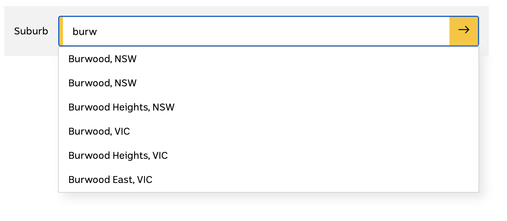
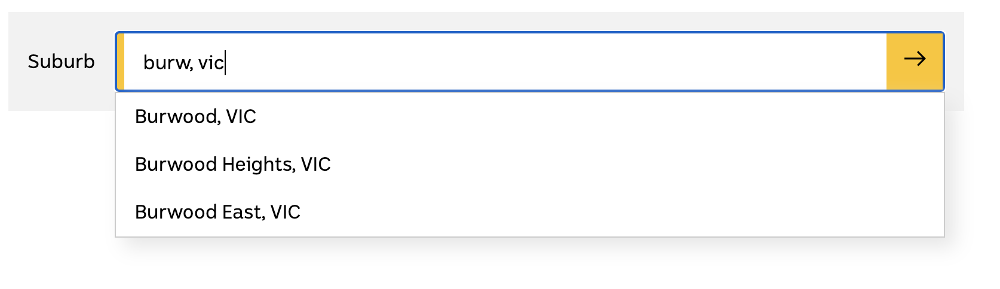

# Steven's Solutions

## Updates
* Updated to latest react version: v16.13.1
* Updated all class components to functional components and using hoop api
* Applied Typescript into this application
* Applied Sass into this application

## Features
Done all code test requirements, apart from that also did below fetures:
* Hide suggestions dropdown after selected one suburb suggestion
* More intelligent, based on state input filter suburb with start letters, please check last screenshot section
* Custome Hook to handle input deboucing, reduce unnessary http request
* Error handling when http request failed
* Define sass variables for easy mantainance

## Unit Tests
* Unit tests for all components, container and util
* Branch and function test coverage is 100%

### Run test cases
Runnig below command line to check each unit test result
```sh
$ npm run test
```

## Accessibility
Done below feature to improve user experience and better support accessibility
* Enter key support selected suggestion populated into input element
* Support Arrow up and Arrow down key to change suggestion option

### Screenshot for intelligent filter
* Just input "burd"


* Just input "burd, vic"
